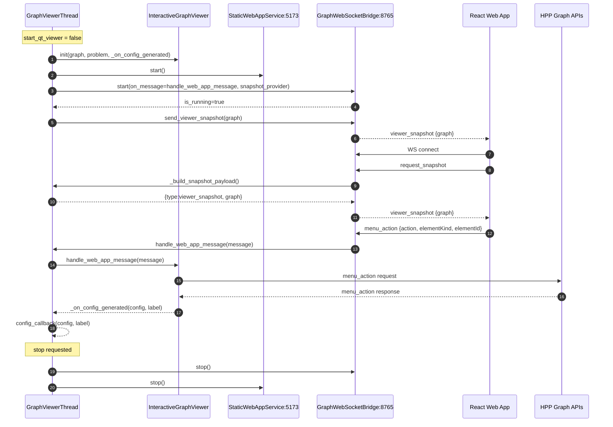

# Web Plot Viewer — Functional Documentation

This document describes the functioning of the web plot viewer component.

---

## 1. General Architecture

---

## 2. Life Cycle

1. `GraphViewerThread.run()` instantiates `InteractiveGraphViewer` with `graph`, `problem`, and a callback `_on_config_generated`.
2. If `start_qt_viewer=True`, the thread calls `self._viewer.show()` and does not start the web app.
3. In web mode:
   - starts an HTTP server serving the web app via `StaticWebAppService.start()`;
   - starts/creates a WebSocket server `GraphWebSocketBridge` that handles communication between Python and JavaScript;
   - immediately sends a snapshot via `send_viewer_snapshot(self.graph)`.
4. The thread stays alive until `stop()` is called and the bridge is no longer running.
5. On stop, `GraphWebSocketBridge.stop()` then `StaticWebAppService.stop()` are called.

---

## 3. Communication

### Messages: Python → UI

| Message | Fields |
|---|---|
| `viewer_snapshot` | `type: viewer_snapshot`, `graph: _serialize_graph(graph)` |
| `menu_action` |   `type: action_success \| error`, `message: result`, `details: : {action: action_name, elementId: element_id}`. |

### Messages: UI → Python

| Message | Fields |
|---|---|
| `request_snapshot` | `type: request_snapshot` |
| `menu_action` | `action`, `elementKind: node \| edge `, `elementId` |
---

## 4. Web App Features

The web frontend includes the following primary features:
- **Interactive Graph Rendering**: cytoscape.js is used to draw the constraint graph.
- **Context Menu**: Right-clicking on nodes, edges, or multiples elements (Selection) opens a context menu with `menu_action` options.
- **Waypoints Toggling**: Edges with multiple waypoints and intermediary nodes can be collapsed/hidden to clean up the graph view.
- **Graph Layouts & Fitting**: Action to refit the layout to the viewport and regenerate the graph arrangement algorithm.
- **Download / Load Config**: Export the current graph (image/JSON) and import a JSON visual configuration.
- **WebSocket Notifications**: Built-in Toast/Notification system indicating network status (`connected`, `disconnected`, `error`) and the result of actions (`action_success`, `error`).

---

## 5. Business Action Routing

Front-end action routing to HPP is handled in `InteractiveGraphViewer.handle_web_app_message`.

**Supported node actions:**
- `generate_random_config`
- `generate_from_current_config`
- `set_target_state`

**Supported edge actions:**
- `extend_current_to_current`
- `extend_current_to_random`

---

## 6. Reference Files

| File | Role |
|---|---|
| `src/web_app/*` | React Aplication |
| `src/pyhpp_plot/graph_viewer_thread.py` | Main thread managing the viewer lifecycle |
| `src/pyhpp_plot/interactive_viewer.py` | Business logic and HPP action dispatch |
| `src/pyhpp_plot/websocket_bridge.py` | WebSocket bridge between Python and the UI |
| `src/pyhpp_plot/web_app_server.py` | Static HTTP server serving the React web app |
